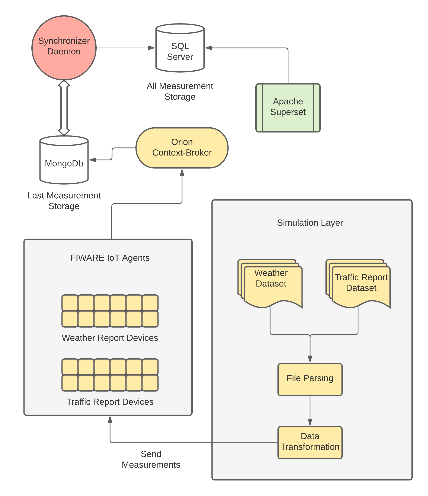

# FIWAREHub
> FIWARE as a means of big data analysis.

[![NPM Version][npm-image]][npm-url]
[![Build Status][travis-image]][travis-url]
[![Downloads Stats][npm-downloads]][npm-url]

FIWAREHub was released as a dissertation for my academic studies.
It serves the purpose of creating a FIWARE ecosystem in order to analyze big data.
In my case, FIWARE IoT agents were provisioned as a simulation layer for big data, fed from a dataset store.
The data was later imported into a SQL Database and analyzed further via the use of Business Intelligence software.



## Installation

OS X & Linux:

```sh
npm install my-crazy-module --save
```

Windows:

```sh
edit autoexec.bat
```

## Usage example

A few motivating and useful examples of how your product can be used. Spice this up with code blocks and potentially more screenshots.

_For more examples and usage, please refer to the [Wiki][wiki]._

## Development setup

Describe how to install all development dependencies and how to run an automated test-suite of some kind. Potentially do this for multiple platforms.

```sh
make install
npm test
```

## Release History

* 0.2.0
	* Software architecture implemented
* 0.0.1
    * Work in progress

## Meta

Yiannis Petsas - el05628@ntua.gr

 Distributed under the GPL license. See ``LICENSE`` for more information.

[https://github.com/petsasj/FIWAREHub](https://github.com/petsasj/)

## Contributing

1. Fork it (<https://github.com/yourname/yourproject/fork>)
2. Create your feature branch (`git checkout -b feature/fooBar`)
3. Commit your changes (`git commit -am 'Add some fooBar'`)
4. Push to the branch (`git push origin feature/fooBar`)
5. Create a new Pull Request

<!-- Markdown link & img dfn's -->
[npm-image]: https://img.shields.io/npm/v/datadog-metrics.svg?style=flat-square
[npm-url]: https://npmjs.org/package/datadog-metrics
[npm-downloads]: https://img.shields.io/npm/dm/datadog-metrics.svg?style=flat-square
[travis-image]: https://img.shields.io/travis/dbader/node-datadog-metrics/master.svg?style=flat-square
[travis-url]: https://travis-ci.org/dbader/node-datadog-metrics
[wiki]: https://github.com/yourname/yourproject/wiki